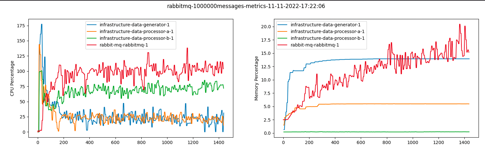

# Integration Test Suite

We want to be able to view how each container runs during different stress
test situations. 

## Tests

### N Messages to Consumers
This test continuously produces messages from the generator until the set number
of messages have been sent from the producer and consumed from the processors.
To run set the number of messages by `--number-messages` and the `--broker`.

### Timed Run with Consistent Production
This test is a duration test, that has the producer consistently send messages
on a fixed delay for an amount of time. To run set the number of messages to be
sent on the interval with `--number-messages`, the delay in ms between production
with `--message-rate`, the duration of the test in seconds with `--time` and the current
broker with `--broker`

## Setup
Make sure you have your virtual environment setup correctly, I suggest
using Pycharm for ease of use. 

Run in the root directory to install the necessary packages.

`pip install .`

Start the correct broker in another terminal.

Run `__main__.py` with command line arguments to define a test.

Ex.

`python __main__.py --number-messages=1000 --broker=activemq --docker-compose=../../infrastructure/docker-compose.yml`

After the test completes a graph will appear in a new window of metrics from the test.

